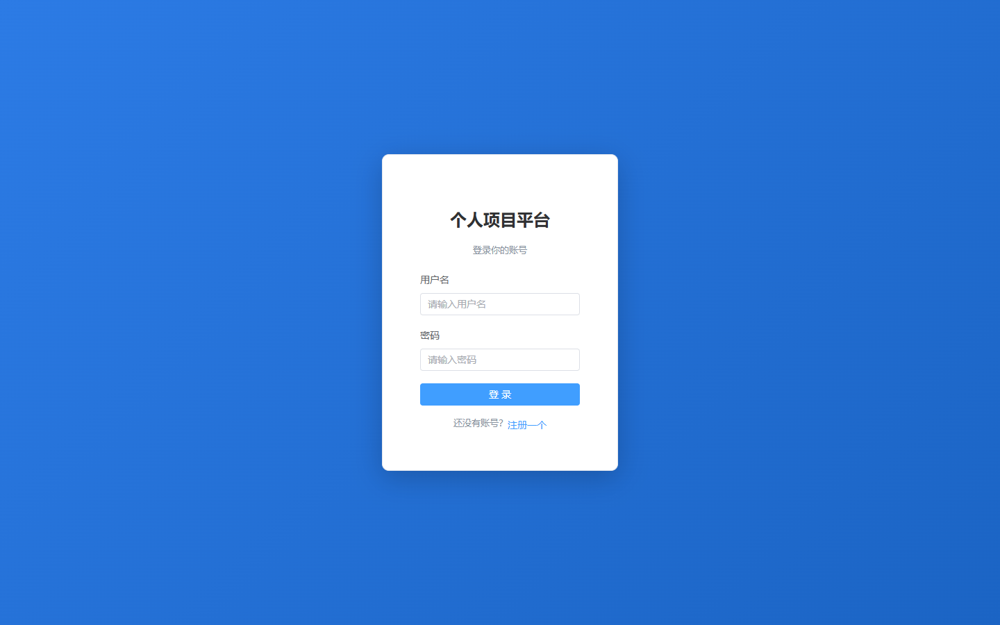
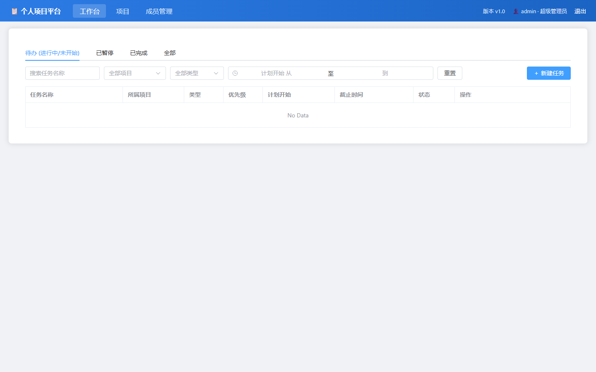
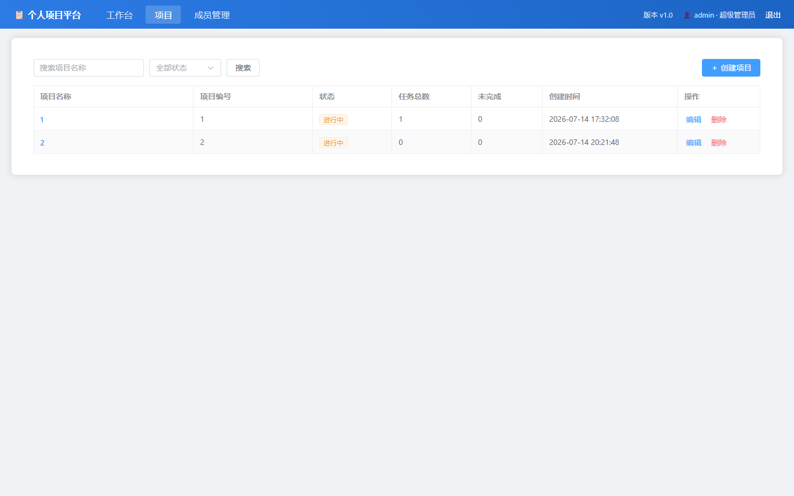
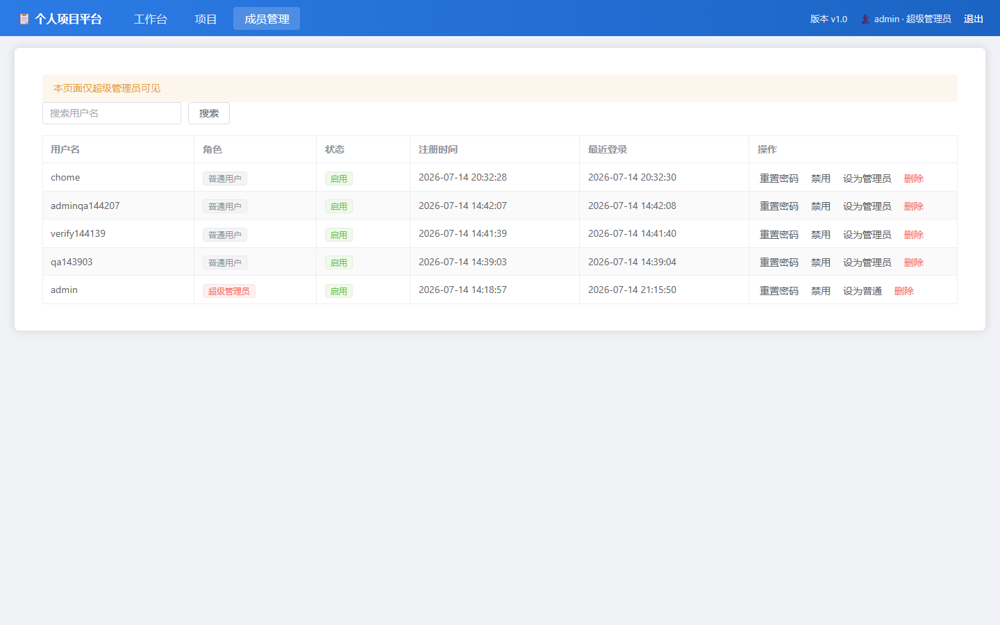

# 个人项目平台

一个轻量、API 优先的个人项目与任务管理平台。Web 前端与未来 Android 客户端共用同一套 REST API，聚焦“待办不遗漏”、项目归类和任务状态流转。

## 功能

- 用户注册、登录、JWT 鉴权与退出登录。
- 项目创建、编辑、筛选，以及任务总数/未完成数统计。
- 工作台待办、暂停、已完成、全部四个视图。
- 任务创建、编辑、软删除、筛选和严格状态机：开始、暂停、继续、完成、取消、重开。
- 逾期任务标红；任务可归属项目或使用默认项目。
- wangEditor 富文本描述、粘贴图片上传、普通附件上传/删除。
- 管理员成员管理：搜索、重置密码、启用/禁用、设置角色、软删除，并保护最后一个管理员。

## 技术栈

| 层 | 技术 |
| --- | --- |
| 后端 | Java 17、Spring Boot 3.2、MyBatis-Plus、MySQL 8、JWT、BCrypt |
| 前端 | Vue 3、Vite、Element Plus、Pinia、Axios、wangEditor |
| 文件存储 | 本地磁盘 `uploads/yyyy/MM`，通过 `/uploads/**` 访问 |

## 页面效果

| 登录 | 工作台 |
| --- | --- |
|  |  |

| 项目管理 | 成员管理 |
| --- | --- |
|  |  |

## 目录

```text
src/
├── backend/       # Spring Boot REST API、数据库脚本与单元测试
└── frontend/      # Vue 3 Web 前端
doc/               # 需求、开发规范
test/prototype.html # 视觉与交互原型
```

## 环境要求

- JDK 17
- Maven 3.9+
- MySQL 8
- Node.js 20+

## 启动

### 1. 配置数据库

后端连接 `ppm` 数据库；首次启动会自动创建数据库、表和超级管理员。请仅在本地终端设置数据库凭据，不要把密码写入项目文件：

```powershell
$env:DB_USERNAME = "root"
$env:DB_PASSWORD = "你的MySQL密码"
```

### 2. 启动后端

```powershell
cd src/backend
mvn spring-boot:run
```

后端默认运行在 `http://127.0.0.1:8080`。

### 3. 启动前端

```powershell
cd src/frontend
npm install
npm run dev
```

访问 Vite 输出的地址，默认是 `http://127.0.0.1:5173`。

## 初始管理员

| 用户名 | 密码 |
| --- | --- |
| `admin` | `admin123` |

首次登录后请及时修改管理员密码。

## 验证

```powershell
# 后端
cd src/backend
mvn test

# 前端
cd ../frontend
npm test
npm run build
```

## API 约定

所有接口以 `/api` 为前缀，除注册和登录外均携带：

```http
Authorization: Bearer <token>
```

统一响应格式：

```json
{ "code": 0, "message": "ok", "data": {} }
```

完整接口契约位于 [doc/AI开发文档.md](doc/AI开发文档.md)。

## 安全与提交约定

- 本地数据库密码使用 `DB_USERNAME` / `DB_PASSWORD` 环境变量。
- `.gitignore` 已排除构建产物、依赖目录、日志、上传文件、数据库文件、本地配置和 IDE 配置。
- 请勿提交密码、JWT、私钥或真实服务器配置。
